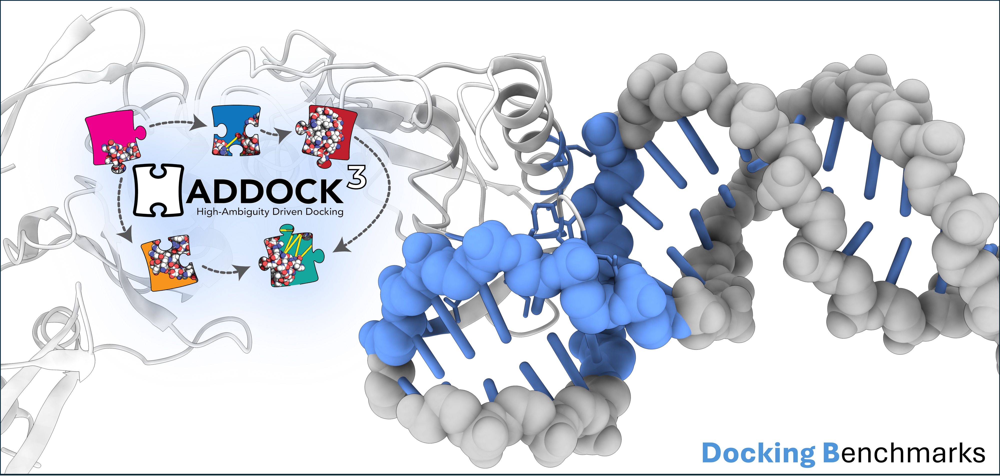
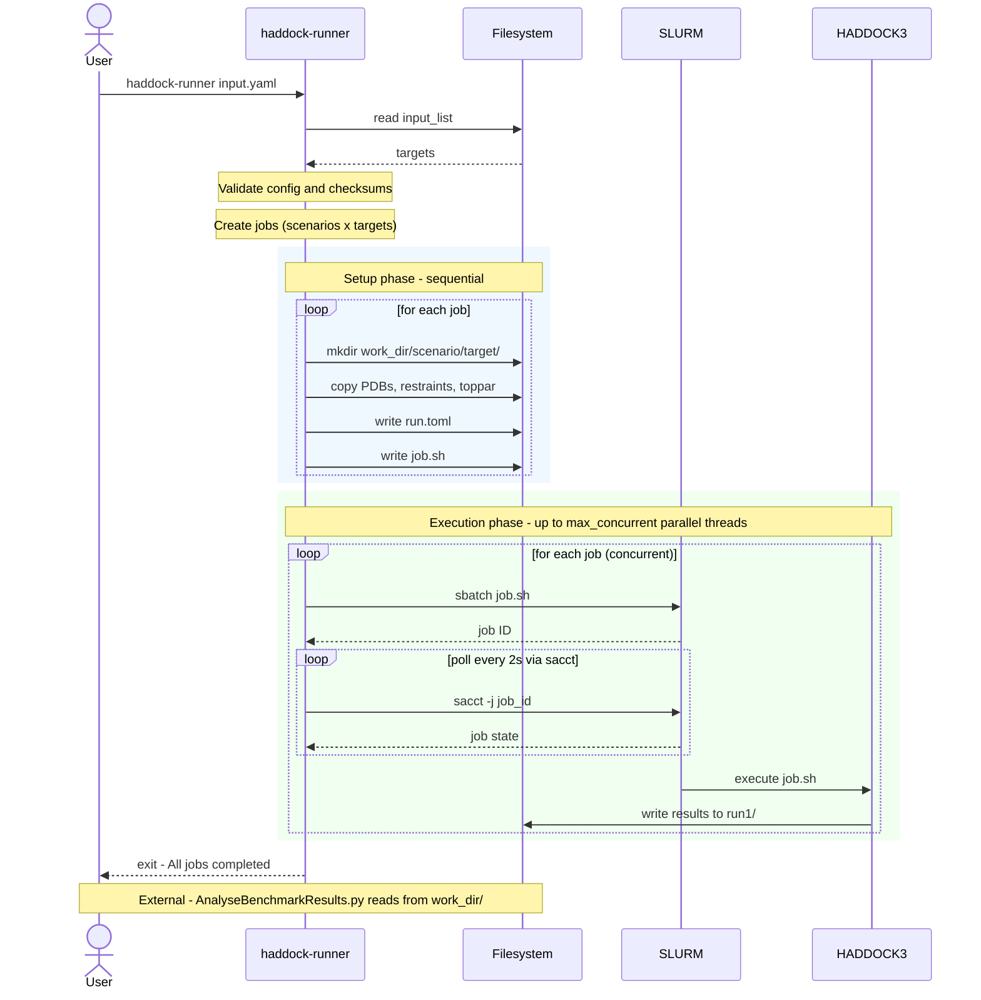

<p align="center">
  
</p>

# HADDOCK3 Benchmarking Suite

[HADDOCK3](https://github.com/haddocking/haddock3) is an information-driven docking platform from [BonvinLab](https://www.bonvinlab.org/), Utrecht University. This repository holds datasets, scenario YAMLs, setup scripts, and an analysis pipeline for benchmarking HADDOCK3 docking protocols (starting from unbound partners, scored against CAPRI quality thresholds) across five system types: protein-protein, protein-peptide, protein-DNA, protein-glycan, and shape-guided protein-ligand. Runs are orchestrated by [haddock-runner](https://github.com/haddocking/haddock-runner), which reads the scenario YAMLs and dispatches SLURM jobs.

## Repository Structure

```
Benchmarking/
├── setup.sh                    # Environment setup entry point
├── run.sh                      # Wrapper: activates env, execs haddock-runner
├── analyse.sh                  # Wrapper: runs analysis/AnalyseBenchmarkResults.py
├── USAGE.md                    # Full usage guide
├── versions.env                # Pinned dataset commit SHAs + haddock-runner/haddock3 versions
├── scripts/                    # Individual setup steps, orchestrated by setup.sh
├── docking_benchmarks/
│   ├── protein_protein/        # Protein-protein benchmark 
│   ├── protein_peptide/        # Protein-peptide benchmark
│   ├── protein_dna/            # Protein-DNA benchmark
│   ├── protein_glycan/         # Protein-glycan benchmark
│   └── protein_ligand_shape/   # Shape-guided protein-ligand benchmark
└── analysis/                   # Post-run analysis and visualisation
```

Each benchmark directory follows the same layout (shown for `protein_protein/`):

```
protein_protein/
├── README.md                               # Dataset description, scenarios, and run instructions
├── setup.sh                                # Downloads and stages input structures
├── unbound_ab-initio_cm.yaml               # Scenario YAML files
├── unbound_ab-initio_ranair.yaml
├── unbound_true-interface.yaml
├── unbound_true-interface5A-cltsel.yaml
└── unbound_true-interface5A.yaml
```

## Quick Start

**1. Set up the environment**

Installs uv, Python 3.14, a venv, HADDOCK3, and haddock-runner locally (nothing system-wide), and stages every benchmark dataset. All dataset and tool versions are pinned in [`versions.env`](versions.env) — edit it and re-run `setup.sh` to converge an existing checkout to a new pin:

```bash
bash setup.sh
```

**2. Run a benchmark scenario**

```bash
./run.sh docking_benchmarks/protein_protein/HADDOCK3_clustfcc.yaml
```

**3. Run all scenarios for a given benchmark**

```bash
./run-all.sh docking_benchmarks/protein_protein
```

**4. Run all scenarios for all  benchmarks**

```bash
./run-all.sh
```

For long runs:

```bash
nohup ./run.sh <scenario.yaml> > run.out & disown && tail -f run.out
```

See [USAGE.md](USAGE.md) for the full guide, SLURM configuration, and troubleshooting.

## Pipeline Overview


## Benchmark Systems

| System | Dataset | Scenarios | Github repositories | Reference |
|---|---|---|---|---|
| Protein-Protein | 230 complexes | 4 | [haddocking/BM5-clean](https://github.com/haddocking/BM5-clean) | Vreven et al. (2015), *JMB* 427(19), 3031-3041 |
| Protein-Peptide | 98 complexes | 3 | [haddocking/protein-peptide](https://github.com/haddocking/protein-peptide) | Trellet et al. (2013), *PLOS ONE* 8(3), e58769 |
| Protein-DNA | 47 complexes | 4 | [haddocking/Prot-DNABenchmark](https://github.com/haddocking/Prot-DNABenchmark) | van Dijk & Bonvin (2008), *NAR* 36(14), e88 |
| Protein-Glycan | 89 complexes | 3 | [haddocking/protein-glycans](https://github.com/haddocking/protein-glycans) | Ranaudo et al. (2024), *JCIM* 64(19), 7816-7825 |
| Protein-Ligand Shape | 99 complexes | 2 | [haddocking/shape-restrained-haddocking](https://github.com/haddocking/shape-restrained-haddocking) | Koukos et al. (2021), *JCIM* |

Each subdirectory README covers the biological context, dataset, restraints, and workflow per scenario.

### Scenario overview

**Protein-Protein**: various restrained and ab-initio docking.

**Protein-Peptide**: various restrained and ab-initio docking.

**Protein-DNA**: bound-bound, bound-unbound, unbound-unbound difficulty levels, plus a gen-decoys scenario for producing a large unrefined decoy set.

**Protein-Glycan**: bound/unbound conformations, ensemble-based restrained docking and one scenario in which the docking takes place during the flexible refinement stages.

**Protein-Ligand Shape**: shape-restrained and pharmacophore-enhanced docking.

See the respective README.md files for details.

## Analysis

After a run completes, generate CAPRI performance plots and a JSON summary:

```bash
./analyse.sh <benchmark_results_dir>
```

Classifies models by CAPRI quality (High/Medium/Acceptable/Near-acceptable/Low), producing bar/violin/melquiplots and a JSON report. See [analysis/README.md](analysis/README.md) for full options.

## Contributing

See [CONTRIBUTING.md](CONTRIBUTING.md) for adding scenarios, systems, or analysis improvements, and [ADDING-SCENARIOS.md](ADDING-SCENARIOS.md) for a full walkthrough of adding a scenario.

## Support

- Code issues: [open an issue](https://github.com/haddocking/benchmarking/issues/new)

## Useful resources

- [`haddock-runner`](https://github.com/haddocking/haddock-runner): runs large-scale `haddock3` docking scenarios
- [`haddock-tools`](https://github.com/haddocking/haddock-tools): utility scripts from the BonvinLab group
- [`haddock-runner` user manual](https://www.bonvinlab.org/haddock-runner/home.html): online pipeline guide

## Cite us

If you used `haddock3` for your research, please cite:

- **Research article**: M. Giulini, V. Reys, J.M.C. Teixeira, B. Jiménez-García, R.V. Honorato, A. Kravchenko, X. Xu, R. Versini, A. Engel, S. Verhoeven, A.M.J.J. Bonvin, [*HADDOCK3: A modular and versatile platform for integrative modelling of biomolecular complexes*](https://pubs.acs.org/doi/10.1021/acs.jcim.5c00969) Journal of Chemical Information and Modeling (2025). doi: 10.1021/acs.jcim.5c00969

For specific benchmark datasets, see the `Citation` section in each `docking_benchmarks/` subdirectory's README.
