<p align="center">
  
</p>

# HADDOCK3 Benchmarking Suite

[HADDOCK3](https://github.com/haddocking/haddock3) is an information-driven docking platform developed at [BonvinLab](https://www.bonvinlab.org/), Utrecht University, that uses experimental or predicted binding-site data as ambiguous interaction restraints to guide the assembly of biomolecular complexes. Benchmarking evaluates how reliably a docking protocol can predict the correct bound structure when starting only from the free, unbound partners and scoring the results against CAPRI quality thresholds. This repository provides the datasets, scenario YAML files, setup scripts, and analysis pipeline to run and compare those benchmarks across five molecular system types: protein-protein, protein-peptide, protein-DNA, protein-glycan, and shape-guided protein-ligand docking. All benchmarks are orchestrated using [haddock-runner](https://github.com/haddocking/haddock-runner), an in-house tool that reads scenario YAML files, stages inputs, and dispatches SLURM jobs across cluster nodes.

## Repository Structure

```
Benchmarking/
├── Setup/                      # Environment setup script
├── Docking_benchmarks/
│   ├── Protein_Protein/        # Protein-protein benchmark 
│   ├── Protein_Peptide/        # Protein-peptide benchmark
│   ├── Protein_DNA/            # Protein-DNA benchmark
│   ├── Protein_Glycan/         # Protein-glycan benchmark
│   └── Protein_Ligand_Shape/   # Shape-guided protein-ligand benchmark
├── Analysis/                   # Post-run analysis and visualisation
└── Usage/                      # Full usage guide 
```

Each benchmark directory follows the same layout (shown for `Protein_Protein/`):

```
Protein_Protein/
├── README.MD                               # Dataset description, scenarios, and run instructions
├── setup.sh                                # Downloads and stages input structures
└── Scenarios/                              # YAML scenario files
    ├── scenario_HADDOCK24_default.yaml
    ├── scenario_HADDOCK24_default_5Aambig.yaml
    ├── scenario_HADDOCK24_ab_initio.yaml
    ├── scenario_HADDOCK3_clustfcc.yaml
    └── scenario_HADDOCK3_ilrmsdclustering.yaml
```

## Quick Start

**1. Set up the environment**

Run the setup script from the repository root. It installs pyenv, Python 3.9.18, a local virtual environment, HADDOCK3, and haddock-runner — nothing is changed system-wide.

```bash
bash Setup/Haddock_runner_setup.sh
```

See [Setup/README.MD](Setup/README.MD) for prerequisites, a step-by-step description of what the script does, and troubleshooting notes.

**2. Substitute absolute paths in scenario files**

Run this once from the repository root before running any benchmark:

```bash
find . -type f -name "*.yaml" -exec sed -i "s|_ABSPATH_PWD_|$PWD|g" {} +
```

**3. Run a benchmark scenario**

```bash
./haddock-runner Docking_benchmarks/Protein_Protein/Scenarios/scenario_HADDOCK3_clustfcc.yaml
```

For long runs, use `nohup` and `disown` to keep the job alive after disconnecting from SSH:

```bash
nohup ./haddock-runner <scenario.yaml> > run.out & disown && tail -f run.out
```

See [Usage/README.MD](Usage/README.MD) for the full guide including SLURM configuration and troubleshooting.

## Pipeline Overview

<p align="center">
  
</p>

## Benchmark Systems

| System | Dataset | Scenarios | Github repositories |
|---|---|---|---|
| Protein-Protein | 230 complexes | 5 | [haddocking/BM5-clean](https://github.com/haddocking/BM5-clean) |
| Protein-Peptide | 98 complexes | 3 | [haddocking/protein-peptide](https://github.com/haddocking/protein-peptide) |
| Protein-DNA | 47 complexes | 3 | [haddocking/Prot-DNABenchmark](https://github.com/haddocking/Prot-DNABenchmark) |
| Protein-Glycan | 89 complexes | 3 | [haddocking/protein-glycans](https://github.com/haddocking/protein-glycans) |
| Protein-Ligand Shape | 102 complexes | 2 | [haddocking/shape-restrained-haddocking](https://github.com/haddocking/shape-restrained-haddocking) |

Each subdirectory README describes the biological context, input dataset, restraint strategy, the HADDOCK3 workflow for each scenario.

### Scenario overview

**Protein-Protein** — evaluates five protocols ranging from fully restrained docking (default HADDOCK2.4 AIRs) to completely blind ab initio docking, plus two HADDOCK3-specific clustering protocols (FCC and ilRMSD-based).

**Protein-Peptide** — benchmarks three strategies: best-case true-interface restraints, fully blind ab initio docking (10,000 rigid-body models), and FCC clustering protocol.

**Protein-DNA** — tests docking across three difficulty levels bound-bound, bound-unbound and unbound-unbound

**Protein-Glycan** — scenarios cover bound and unbound conformations and ensemble-based glycan sampling.

**Protein-Ligand Shape** — evaluates shape-bead-guided docking and pharmacophore-enhanced shape docking for cases where only approximate ligand geometry is available.

## Analysis

After a benchmark run completes, generate CAPRI performance plots and a JSON summary:

```bash
python3 Analysis/AnalyseBenchmarkResults.py <benchmark_results_dir> 
```

The script classifies docking models by CAPRI quality (High / Medium / Acceptable / Near-acceptable / Low) and produces stacked bar plots, violin plots, melquiplots, and a JSON performance report. See [Analysis/README.md](Analysis/README.md) for the full option reference and output file descriptions.

## Contributing

See [contributing.md](contributing.md) for instructions on adding new scenarios, new benchmark systems, or improvements to the analysis pipeline.

## Support

- If you encounter any code-related issues, [open an issue](https://github.com/haddocking/benchmarking/issues/new)

## Useful resources

- [`haddock-runner`](https://github.com/haddocking/haddock-runner): Tool to run large scale `haddock3` docking scenarios using multiple input molecules in different scenarios
- [`haddock-tools`](https://github.com/haddocking/haddock-tools): Set of useful utility scripts developed over the years by the BonvinLab group members
- [`haddock-runner user manual`](https://www.bonvinlab.org/haddock-runner/home.html): The online guide describing every aspects of the pipeline

## Cite us

If you used `haddock3` or `haddock-runner` for your research, please cite :

- **Research article**: M. Giulini, V. Reys, J.M.C. Teixeira, B. Jiménez-García, R.V. Honorato, A. Kravchenko, X. Xu, R. Versini, A. Engel, S. Verhoeven, A.M.J.J. Bonvin, [*HADDOCK3: A modular and versatile platform for integrative modelling of biomolecular complexes*](https://pubs.acs.org/doi/10.1021/acs.jcim.5c00969) Journal of Chemical Information and Modeling (2025). doi: 10.1021/acs.jcim.5c00969
 