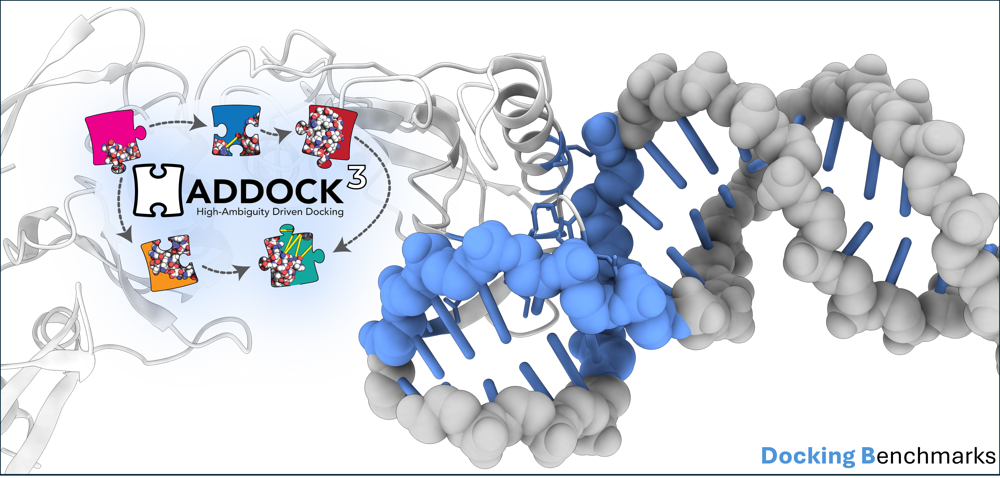

<p align="center">
  
</p>

# HADDOCK Benchmarking Suite
This repository contains the benchmarking suite for the HADDOCK software suite.

## Setup and Installation

**VERY IMPORTANT: Here we will NOT use anaconda, nor a global installation of Haddock or Python.**

Everything must be installed in the current directory, this is to avoid conflicts with other software and keep the system clean.

We will use `pyenv` to manage the python version and virtual environments.

The setup will be **LOCAL nothing will be changed in the cluster for other users**.

1. Install `pyenv`
2. Compile Python 3.9.18
3. Create a virtual environment with Python 3.9.18
4. Clone `haddock3` repository
5. Install `haddock3` in the virtual environment
6. Download a static pre-compilled CNS binary
7. Download the latest version of `haddock-runner`

```bash
bash setup-tintin.sh
```

## Usage

Simply run:

```
./haddock-runner <config-file>.yaml
```

You don't need to activate the virtual environment or wory about python, the `haddock-runner` takes care of it.

## Example

```bash
# Setup the project
bash setup-tintin.sh

# Setup BM5
cd prot-prot-bm5 && bash setup.sh && cd ..

## Temporary: replace the path to the benchmarking suite
sed -i "s|/trinity/login/rodrigo/repos/benchmarking|$(pwd)|g" prot-prot-bm5-simple.yaml
find . -type f -name "*.yaml" -exec sed -i "s|_ABSPATH_PWD_|$PWD|g" {} +

# Run the test benchmark 
./haddock-runner prot-prot-bm5-simple.yaml
```

This will run the benchmarking suite for the BM5 dataset using a simple scenario, the results will be stored in the `prot-prot-bm5/simple` directory.

## Run the full BM5 benchmark

Multiple pre-defined protein-protein docking scenarios are set up in `protprotbm5-haddock3-scenarios.yaml`.
To run the benchmark, simply activate the `pyenv` and run `haddock-runner` with this file.
**NOTE:** Here, `nohup`, `&` and `disown` commands are used to allow to run the process in background and disconnect from `ssh`.

```bash
# Activate the pyenv
source .venv/bin/activate

# Run the benchmark
nohup ./haddock-runner protprotbm5-haddock3-scenarios.yaml > bm5-scenarios.out & disown && tail -f bm5-scenarios.out

# Wait several hours
```

## Run the protein - ligand shape docking

### Setting it up

```bash
cd protein-ligand-shape
chmod u+x setup.sh
./setup.sh
cd ..
```

### Running example

```bash
nohup ./haddock-runner protein-ligand-shape/benchmark-unbound-unbound-small.yml > prot-lig-test.out & disown && tail -f prot-lig-test.out
```


### Running actual benchmark

```bash
./haddock-runner protein-ligand-shape/benchmark-unbound-unbound-shape.yml
```
